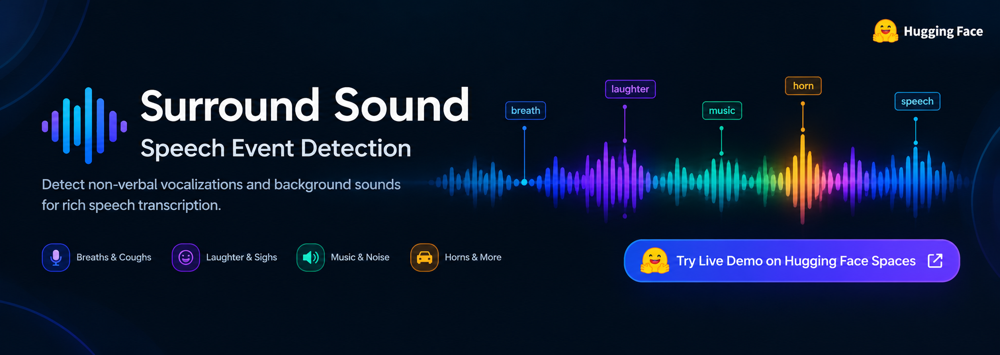

<p align="center">
  <a href="https://huggingface.co/spaces/theboringai-work/surround-sound">
    
  </a>
</p>

Detects **54 kinds of non-verbal and background sounds**, with start and end times, in any audio, and merges them into a Whisper transcript. An illustrative example:

```
Hey [cough] there, can you tell me where I am going? [breath] So I want to understand <horn> the road was blocked </horn> okay.
```

- `[tag]`: a sound the **speaker** makes (breath, cough, laugh, sigh, sniff, …). It's placed inline where the sound starts.
- `<tag> … </tag>`: a **background** sound (horn, music, dog bark, siren, rain, …), wrapped around the words it overlaps. A lone `<tag>` means no words fall inside it.

The model is a 5.8M-parameter CNN + Transformer that runs on log-mel spectrograms and outputs a probability for each class every 40 ms. It runs about 39× faster than real time on 8 CPU threads and 380× on a T4 GPU (measured on 3 min of audio). Experiment 1 (`exp1`), the first released model, was trained on material drawn from seven public datasets: about 168 h of real annotated training recordings (plus 17 h held out for validation), 65 h of event crops, 21 h of speech beds and 6 h of background noise, with synthetic mixing and augmentation. The full method and results are in the paper in `paper/`.

## Contents
- [Quick start](#quick-start)
- [Output](#output)
- [Python API](#python-api)
- [Command-line options](#command-line-options)
- [Threshold profiles](#threshold-profiles)
- [Tags and how well they work](#tags-and-how-well-they-work)
- [Held-out results](#held-out-results)
- [Examples](examples/README.md)
- [How it works](#how-it-works)
- [Training](#training)
- [Repository layout](#repository-layout)
- [Data and licensing](#data-and-licensing)
- [Known limitations](#known-limitations)
- [Tests](#tests)

## Quick start

```bash
# Python 3.9+, plus the ffmpeg binary (apt install ffmpeg / brew install ffmpeg)
pip install -r requirements.txt          # or: pip install -e .   (installs the `sed-infer` command)
pip install openai-whisper               # optional, for transcripts; `transformers` is used if this is missing

python scripts/infer.py call.mp3                                    # transcript with tags + event list
python scripts/infer.py recordings/ --asr none --json events.jsonl  # events only, a whole folder, JSON lines
python scripts/infer.py call.wav --language hi --hide breath,lip_smack --times
```

`scripts/infer.py`, `python -m sed.cli` and `sed-infer` (after `pip install -e .`) are the same program. By default it uses `checkpoints/` (Experiment 1).

## Output

For each file it prints the transcript and the event list:

```
=== call.mp3  (22.27s)
Hey [cough] there, can you tell me exactly where I am going to … [breath] okay got it.
     0.68-   2.00s  cough          p=0.92
     7.72-   8.72s  breath         p=0.94
```

With `--json out.jsonl`, each file becomes one JSON record:

```json
{"file": "call.mp3", "duration": 22.27,
 "events": [{"label": "cough", "start": 0.68, "end": 2.0, "prob": 0.92}, ...],
 "words": [{"word": "Hey", "start": 0.0, "end": 0.42}, ...],
 "transcript": "Hey [cough] there, ..."}
```

`prob` is the event's mean frame probability. `start` and `end` are in seconds, on the model's 40 ms grid.

## Python API

```python
from sed import Detector, load_audio, rich_transcript, clean

det = Detector.from_dir("checkpoints", profile="sensitive")      # or profile="balanced"
events = det.detect("call.mp3")                                   # path (any ffmpeg format) or 16 kHz float array
# [{'label': 'cough', 'start': 0.68, 'end': 2.0, 'prob': 0.92}, ...]

times, probs = det.frame_probs(load_audio("call.mp3"))           # raw per-class probabilities, 40 ms grid

# merge with any ASR that gives word timestamps: words = [(word, start_s, end_s), ...]
text = rich_transcript(words, clean(words, events))               # clean() drops a laugh the ASR already wrote as "haha"
```

`Detector.from_pretrained("theboringai-work/surround-sound")` loads the published Hub version in the same way.

## Command-line options

| option | meaning |
|---|---|
| `--model DIR_OR_REPO` | model folder (default `checkpoints/`) or a Hugging Face repo id; `--ckpt-dir` is an alias |
| `--profile sensitive\|balanced` | threshold set (default `sensitive`, see below) |
| `--asr auto\|openai-whisper\|transformers\|none` | transcription backend; `none` prints events only |
| `--asr-model small` | Whisper size: `tiny` … `large-v3` |
| `--language hi` | skip language detection |
| `--hide breath,lip_smack` | leave these tags out |
| `--thr sigh=0.7,machine=1.01` | per-run threshold changes (a value above 1 switches a class off) |
| `--min-prob 0.8` | drop events whose mean probability is below this |
| `--times` | write `[cough 0.68-2.00]` instead of `[cough]` |
| `--json out.jsonl` | one JSON record per file |
| `--device cpu\|cuda` | default: CUDA if available |

## Threshold profiles

Each class has its own threshold, tuned on real held-out recordings by 2-fold cross-validation (tune on one half, score on the other). Both files ship with the model:

| profile | file | tuned for | use when |
|---|---|---|---|
| `sensitive` (default) | `thresholds_sensitive.json` | F2: a missed sound counts twice as much as a false tag | you'd rather review extra tags than miss sounds |
| `balanced` | `thresholds.json` | F1 | precision matters as much as recall |

On the 43 reliably measured classes, the sensitive profile averages recall 0.52 at precision 0.27, and the balanced profile recall 0.41 at precision 0.35 (frame level, cross-validated). Permanent per-class changes go in `checkpoints/threshold_overrides.json` as `{"sensitive": {"sigh": 0.7}, "balanced": {...}}`; they're applied on top of the profile.

Detection post-processing: probabilities are averaged over overlapping 8 s windows (2 s hop), median-filtered over 5 frames (200 ms), thresholded with hysteresis (an event starts above the threshold and continues above 0.6 × threshold), joined across gaps (0.3 s for speaker sounds, 1.0 s for background), and events shorter than 0.15 s are dropped.

## Tags and how well they work

**frame AP** is the class's frame-level average precision on real held-out windows (threshold-free). **CV F1** is the cross-validated frame F1 at the balanced threshold. **found** is the share of held-out real events that get an overlapping tag of the right class with the sensitive profile (event level; see `docs/EVALUATION.md`). **weak** means fewer than 25 positive validation frames or CV F1 below 0.1. Weak classes still fire, but treat their tags as hints.

### Speaker sounds, inline `[tag]` (20)
| tag | frame AP | CV F1 (balanced) | held-out events found (sensitive) | status |
|---|---|---|---|---|
| `sigh` | 0.72 | 0.65 | 84% of 389 | reliable |
| `snore` | 0.55 | 0.61 | 68% of 28 | reliable |
| `laugh` | 0.52 | 0.47 | 79% of 587 | reliable |
| `breath` | 0.50 | 0.50 | 80% of 1,116 | reliable |
| `sniff` | 0.44 | 0.42 | 65% of 272 | reliable |
| `sneeze` | 0.43 | 0.21 | 0% of 8 | reliable |
| `scream` | 0.42 | 0.13 | 16% of 32 | reliable |
| `throat_clear` | 0.34 | 0.38 | 62% of 190 | reliable |
| `cough` | 0.31 | 0.40 | 56% of 329 | reliable |
| `whisper` | 0.30 | 0.37 | 36% of 36 | reliable |
| `burp` | 0.22 | 0.28 | 57% of 7 | reliable |
| `shout` | 0.15 | 0.26 | 45% of 97 | reliable |
| `cry` | 0.07 | 0.05 | 43% of 61 | weak |
| `gasp` | 0.07 | 0.13 | 37% of 41 | reliable |
| `lip_smack` | 0.05 | 0.13 | 22% of 9 | reliable |
| `chew` | 0.04 | 0.06 | 10% of 29 | weak |
| `groan` | 0.01 | 0.03 | 19% of 36 | weak |
| `yawn` | 0.01 | 0.01 | 7% of 14 | weak |
| `hiccup` | 0.00 | 0.01 | 21% of 14 | weak |
| `nose_blow` | 0.00 | 0.00 | 0% of 1 | weak |

### Background sounds, `<tag> … </tag>` (34)
| tag | frame AP | CV F1 (balanced) | held-out events found (sensitive) | status |
|---|---|---|---|---|
| `music` | 0.88 | 0.81 | 84% of 1,361 | reliable |
| `horn` | 0.59 | 0.56 | 76% of 258 | reliable |
| `applause` | 0.58 | 0.48 | 34% of 199 | reliable |
| `whistle` | 0.52 | 0.49 | 28% of 83 | reliable |
| `dog_bark` | 0.51 | 0.47 | 66% of 128 | reliable |
| `vehicle` | 0.50 | 0.49 | 87% of 549 | reliable |
| `siren` | 0.49 | 0.47 | 58% of 114 | reliable |
| `bird` | 0.40 | 0.43 | 64% of 791 | reliable |
| `water` | 0.39 | 0.38 | 75% of 192 | reliable |
| `insect` | 0.38 | 0.43 | 42% of 87 | reliable |
| `cheer` | 0.32 | 0.33 | 26% of 73 | reliable |
| `crowd` | 0.32 | 0.24 | 61% of 41 | reliable |
| `wind` | 0.32 | 0.30 | 68% of 206 | reliable |
| `gunshot` | 0.31 | 0.32 | 81% of 75 | reliable |
| `bell` | 0.26 | 0.35 | 80% of 87 | reliable |
| `explosion` | 0.22 | 0.46 | 63% of 54 | reliable |
| `baby_cry` | 0.22 | 0.40 | 39% of 31 | reliable |
| `construction` | 0.21 | 0.33 | 67% of 220 | reliable |
| `glass_break` | 0.20 | 0.21 | 12% of 58 | reliable |
| `dishes` | 0.20 | 0.20 | 42% of 50 | reliable |
| `phone_vibrate` | 0.17 | 0.40 | 25% of 4 | reliable |
| `rain` | 0.16 | 0.28 | 12% of 43 | reliable |
| `animal` | 0.15 | 0.14 | 52% of 538 | reliable |
| `child_voice` | 0.15 | 0.19 | 48% of 179 | reliable |
| `machine` | 0.14 | 0.28 | 51% of 137 | reliable |
| `thunder` | 0.10 | 0.19 | 54% of 13 | reliable |
| `buzzer` | 0.09 | 0.12 | 20% of 25 | reliable |
| `beep` | 0.09 | 0.18 | 56% of 165 | reliable |
| `phone_ring` | 0.09 | 0.20 | 70% of 64 | reliable |
| `door` | 0.08 | 0.03 | 5% of 21 | weak |
| `tv_speaker` | 0.04 | 0.07 | 44% of 23 | weak |
| `footsteps` | 0.04 | 0.08 | 50% of 218 | weak |
| `fan` | 0.04 | 0.04 | 15% of 13 | weak |
| `knock` | 0.00 | 0.00 | 0% of 5 | weak |

`click` was in the event list but had only 47 examples (minimum 80), so it isn't trained.

## Held-out results

Whole held-out real clips (Vaani from unseen districts, NonVerbalSpeech-38K hash split, NonverbalTTS dev + test, AudioSet-Strong evaluation split) were run through the full detector. A true event is **found** if a prediction of the same class overlaps it, and a prediction is **correct** if it overlaps a true event of the same class. Macro averages over classes:

| classes (≥10 held-out events each) | classes | events | recall (sensitive) | recall (balanced) | precision (sensitive) | precision (balanced) | F1 (sensitive) | F1 (balanced) |
|---|---|---|---|---|---|---|---|---|
| speaker sounds | 16 | 3,271 | 0.46 | 0.33 | 0.38 | 0.40 | 0.38 | 0.34 |
| background sounds | 32 | 6,096 | 0.51 | 0.39 | 0.26 | 0.34 | 0.29 | 0.33 |
| all | 48 | 9,367 | 0.49 | 0.37 | 0.30 | 0.36 | 0.32 | 0.33 |

Thresholds were tuned on held-out data that overlaps these clips, so the absolute numbers are somewhat optimistic. No standard benchmark (e.g. DCASE) has been run yet. Per-class values are in `checkpoints/event_eval.csv` and `docs/EVALUATION.md`.

**Worked examples:** [`examples/README.md`](examples/README.md) shows eight held-out clips, chosen by a fixed rule, with annotated vs detected events and tagged transcripts (8 of 22 annotated events found with the sensitive profile on these clips).

## How it works

1. **Model.** A 64-band log-mel spectrogram (10 ms hop) goes through 5 convolutional blocks, which downsample frequency ×16 and time ×4. A 6-layer Transformer encoder (d = 256, 8 heads) follows, then a linear layer with a sigmoid per class: one probability per class every 40 ms over an 8 s window.
2. **Training data with exact timestamps.**
   - *Synthetic mixes:* labelled event crops pasted into speech at random times and levels, so their timestamps are known exactly.
   - *Real annotated recordings:* NonVerbalSpeech-38K, Vaani, AudioSet-Strong, and NonverbalTTS with forced-aligned timestamps.
   - *Augmentation:* real background noise (DNC, DEMAND), coloured noise, hum, babble, inserted silence, reverb, a phone-band filter and gain changes.
3. **Training.** Frame-level binary cross-entropy with class-balanced positive weights, plus a clip-level term. Model selection uses macro average precision on real held-out audio.
4. **Thresholds.** Per class, two profiles (above).
5. **Transcript merge.** Whisper's word timestamps decide where each tag goes, and the ASR word order is never changed.

`docs/TRAINING.md` walks through every step of the pipeline.

## Training

Two notebooks run the same pipeline, both generated from `training/build_notebooks.py`:

| notebook | where | data access | time (full run) |
|---|---|---|---|
| `training/train_local.ipynb` | any machine with a 16 GB GPU, ~100 GB of fast disk | downloads the datasets once to `SED_WORKDIR` | ~5 h on a T4 after the downloads, 3 h of it training (10 epochs × ~18 min) |
| `training/train_colab.ipynb` | Google Colab, T4 runtime | streams the Hugging Face datasets; backs up to Drive | estimated 5–6 h (smaller data budget) |

Run with `SMOKE = True` first (a tiny subset, every step in minutes), then `SMOKE = False`. The result is written to `checkpoints_new/` and never overwrites `checkpoints/`. **Always edit the builder, then regenerate:** `python training/build_notebooks.py`. Full instructions, the configuration, and disk and time budgets are in `docs/TRAINING.md`.

## Repository layout

```
sed/                       library: model, detector, transcript merge, audio loading, tag lists, CLI
scripts/infer.py           command-line inference (same as `python -m sed.cli`)
checkpoints/               Experiment 1: best.pt, model.safetensors + config.json, both threshold profiles,
                           detect_config.json, threshold_report.csv, event_eval.csv, training_log.csv, train_info.json
training/                  build_notebooks.py -> train_local.ipynb, train_colab.ipynb
docs/                      TRAINING.md, DATA.md, EVALUATION.md
examples/                  worked examples on held-out clips (figure, table, transcripts)
paper/                     LaTeX technical report (arXiv style), its figures, data and generating scripts; see paper/README.md
tests/                     pytest checks for the checkpoints, post-processing and transcript merge
```

## Data and licensing

| source | license | used for |
|---|---|---|
| [NonVerbalSpeech-38K](https://huggingface.co/datasets/nonverbalspeech/nonverbalspeech38k) ([paper](https://arxiv.org/abs/2508.05385)) | **CC BY-NC 4.0** (non-commercial research only) | vocal event crops, speech beds, real windows |
| [Vaani Noise Event Timestamps](https://huggingface.co/datasets/ARTPARK-IISc/Vaani-Noise-Event-Dataset) (gated; [blog](https://huggingface.co/blog/ARTPARK-IISc/a-real-world-dataset-for-noise-robust-speech-ai)) | CC BY 4.0 | background/vocal crops, real windows |
| [NonverbalTTS](https://huggingface.co/datasets/deepvk/NonverbalTTS) | Hub tag Apache-2.0; card: **annotations CC BY-NC-SA 4.0**, audio under VoxCeleb/Expresso terms | aligned real windows, crops, English speech beds |
| [AudioSet-Strong mirror](https://huggingface.co/datasets/enyoukai/AudioSet-Strong) | none stated on the mirror (AudioSet audio comes from YouTube) | real windows, crops |
| [OpenSLR 99](https://www.openslr.org/99/) (Deeply Nonverbal Vocalization) | **CC BY-NC-ND 4.0** | vocal crops |
| [DNC](https://doi.org/10.14279/depositonce-11645) (TU Berlin) | MIT | ambient crops, noise pool |
| [DEMAND](https://doi.org/10.5281/zenodo.1227121) | CC BY 4.0 (the record's text also states CC BY-SA 3.0) | ambient crops, noise pool |

**Three sources forbid commercial use, and OpenSLR 99 also forbids derivatives.** Whether trained weights count as a derivative is legally unsettled. Get legal review before any commercial use or redistribution. To publish weights without the ND constraint, retrain without OpenSLR 99; it contributed only 591 of the ~138k event crops. Per-dataset statistics are in `docs/DATA.md`.

## Known limitations

- **Domain.** Most real training audio is Mandarin radio drama (NonVerbalSpeech-38K), Indic phone speech (Vaani), English interviews and acted speech (NonverbalTTS), and YouTube (AudioSet). Other domains, such as call-centre audio, are untested. A few dozen labelled clips from the target domain are the best check.
- **Weak classes.** `tv_speaker`, `fan`, `footsteps`, `cry`, `groan`, `chew`, `door`, `yawn`, `hiccup`, `nose_blow` and `knock` have too little or too noisy held-out data. Their tags are hints.
- **Unlabelled sounds.** Unlabelled sounds in real recordings count as false tags in the evaluation and as negatives in training. Breathing is the main example.
- **Tag placement in transcripts.** It depends on Whisper's word timestamps, which can be off by a few hundred milliseconds.
- **Stationary hum.** Steady hum can still trigger `machine`/`fan` on some microphones. Use `--hide machine,fan` if it does.


The model card's license is `cc-by-nc-sa-4.0` (see [Data and licensing](#data-and-licensing)).

## Tests

```bash
pip install pytest && pytest -q tests/
```
They check the checkpoint with both profiles, that `model.safetensors` matches `best.pt`, hysteresis and gap joining, and that the transcript merge keeps the ASR word order.
