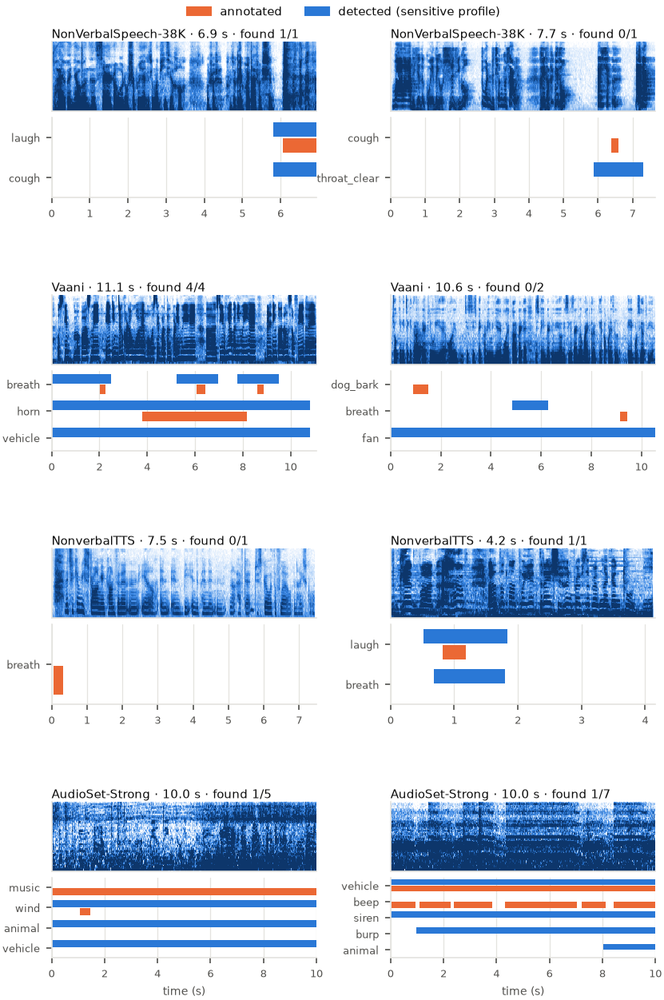

# Examples: how the model performs

Eight **held-out** clips, two from each evaluation source, were run through the released model. None of them was used for training. They were chosen by a fixed rule, not by hand: for each source, the first two held-out clips in storage order that last 5–12 s (NonverbalTTS: 4–12 s; AudioSet-Strong: its 10 s clips) and carry at least one annotated event (Vaani and AudioSet-Strong: at least two event classes). So they show typical behaviour, good and bad. No audio is redistributed here.



*Orange: annotated events. Blue: events detected with the default `sensitive` profile. "found" counts annotated events overlapped by a detection of the same class.*

| clip | source | seconds | annotated events | detected (sensitive) | found (sensitive) | found (balanced) |
|---|---|---|---|---|---|---|
| nv-1 | NonVerbalSpeech-38K | 6.9 | `laugh` 6.1–6.9 | `cough` 5.8–7.0, `laugh` 5.8–7.0 | 1/1 | 0/1 |
| nv-2 | NonVerbalSpeech-38K | 7.7 | `cough` 6.4–6.6 | `throat_clear` 5.9–7.3 | 0/1 | 0/1 |
| vaani-1 | Vaani | 11.1 | `breath` 2.0–2.3, `horn` 3.8–8.2, `breath` 6.1–6.4, `breath` 8.6–8.9 | `breath` 0.0–2.5, `horn` 0.0–10.8, `vehicle` 0.0–10.8, `breath` 5.2–7.0, `breath` 7.8–9.5 | 4/4 | 4/4 |
| vaani-2 | Vaani | 10.6 | `dog_bark` 0.9–1.5, `breath` 9.1–9.4 | `fan` 0.0–10.6, `breath` 4.8–6.3 | 0/2 | 0/2 |
| nvtts-1 | NonverbalTTS | 7.5 | `breath` 0.1–0.3 | – | 0/1 | 0/1 |
| nvtts-2 | NonverbalTTS | 4.2 | `laugh` 0.8–1.2 | `laugh` 0.5–1.8, `breath` 0.7–1.8 | 1/1 | 0/1 |
| audioset-1 | AudioSet-Strong | 10.0 | `music` 0.0–10.0, `wind` 1.1–1.5, `music` 3.0–4.5, `music` 4.7–6.3, `music` 8.9–9.6 | `animal` 0.0–10.0, `vehicle` 0.0–10.0, `wind` 0.0–10.0 | 1/5 | 0/5 |
| audioset-2 | AudioSet-Strong | 10.0 | `vehicle` 0.0–10.0, `beep` 0.0–0.9, `beep` 1.1–2.3, `beep` 2.4–3.9, `beep` 4.3–7.0, `beep` 7.2–8.1, `beep` 8.4–10.0 | `siren` 0.0–10.0, `vehicle` 0.0–10.0, `burp` 1.0–10.0, `animal` 8.0–10.0 | 1/7 | 0/7 |
| **total** | | | | | **8/22** | **4/22** |

Times are in seconds. A detected class that the clip's source never annotates (e.g. `vehicle` in a Vaani clip whose annotators tagged only the horn) can't be judged right or wrong from the labels.

**What these show:**
- **Clear vocal events are found:** the horn and all three breaths in the first Vaani clip, and both laughs.
- **Short or quiet events are often missed:** a 0.2 s cough, a dog bark and short breaths.
- **Background sounds get confused:** the music in the first AudioSet clip was missed while `animal` and `vehicle` fired, steady noise triggered `fan` in a Vaani clip, and repeated short beeps were missed entirely.

These are 8 clips. For averages over all held-out clips, see `docs/EVALUATION.md`.

## Transcripts (English NonverbalTTS clips, Whisper small + detected events)
- **nvtts-1** (annotated: `breath` 0.1–0.3):
  ```
  That you can be strong and confident and you know and be independent and not have to just go with the flow in high school
  ```
- **nvtts-2** (annotated: `laugh` 0.8–1.2):
  ```
  It's good, [laugh] but I [breath] have to go to Tray and go to Gantur.
  ```

The words are Whisper's own; recognition errors such as misheard place names are not corrected. In the second transcript, `[breath]` isn't annotated, so by the evaluation protocol it counts as a false tag, although it may be an unlabelled breath. `[tag]` marks a speaker sound placed where it starts.

## Run it yourself

```bash
python scripts/infer.py my_audio.mp3                    # transcript with tags + event list (sensitive profile)
python scripts/infer.py my_audio.mp3 --profile balanced # fewer, more precise tags
python scripts/infer.py my_audio.mp3 --asr none --times # events only, with times
```

To regenerate these examples (needs the training caches): `python paper/scripts/prepare_examples.py --cache <workdir>/cache/full`, then `python paper/scripts/make_figures.py`.
